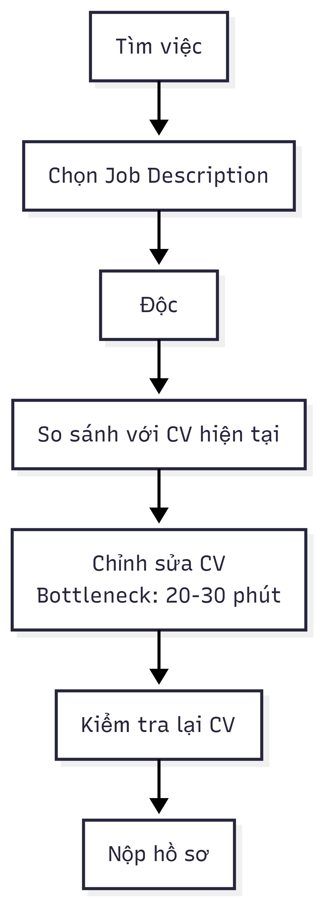
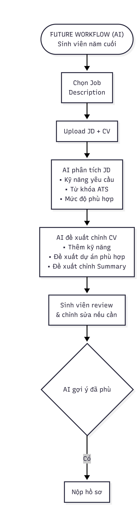
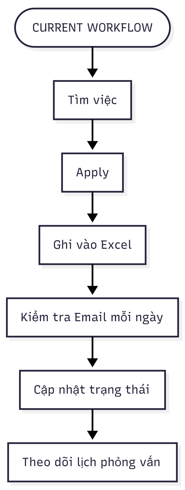
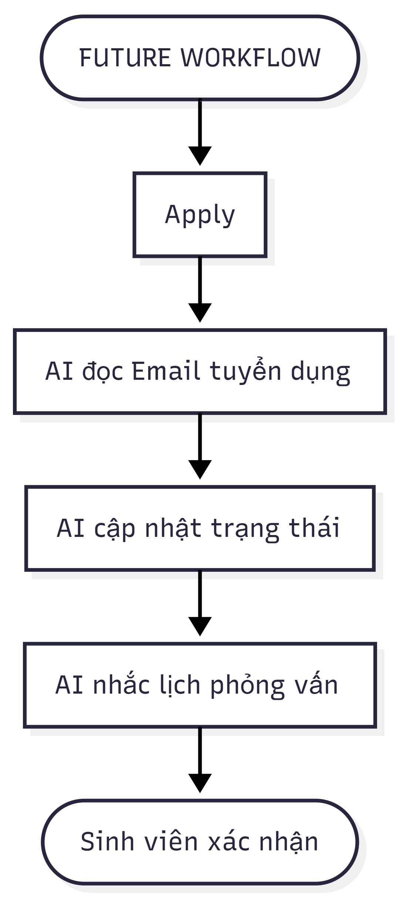
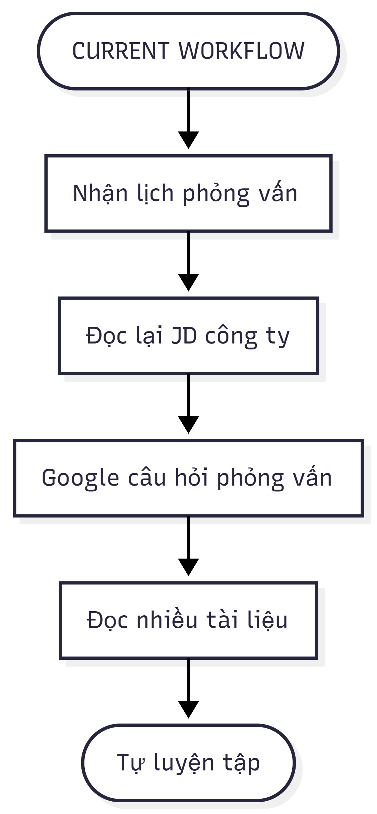
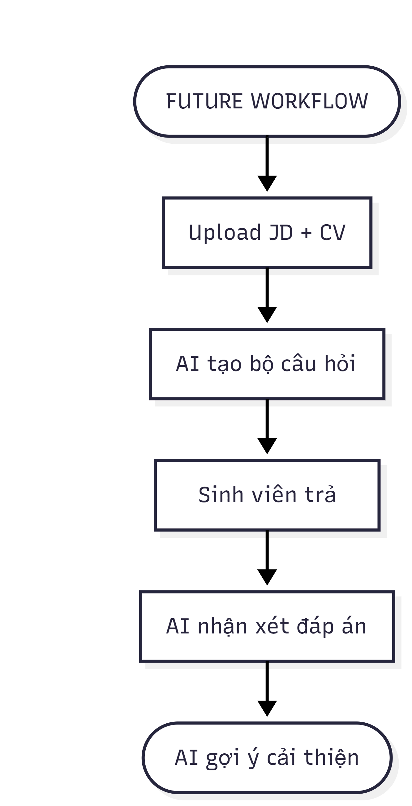

 # 1 Individual scan

 Case: Mình là sinh viên năm cuối mất nhiều thời gian đọc Job Description và chỉnh sửa CV cho từng công ty vì không biết nhà tuyển dụng thực sự cần điều gì.

 # Scan rộng 

| # | Lăng kính | Problem quan sát được | Ai chịu ảnh hưởng? | Dấu hiệu thật |
|---|---|---|---|---|
| 1 | Tốn thời gian | Mỗi công ty yêu cầu CV khác nhau nên phải sửa CV liên tục | Sinh viên năm cuối | Mỗi lần mất 20-40 phút |
| 2 | Lặp lại | Đọc JD rồi so sánh xem mình có phù hợp không | Sinh viên năm cuối| Làm hàng chục lần |
| 3 | AI có thể tốt hơn | Không biết kỹ năng nào còn thiếu so với JD | Sinh viên | Phải tự đọc từng JD|
| 4 | Pain từ người khác | Theo dõi nhiều nền tảng tuyển dụng nên bỏ lỡ job phù hợp | Sinh viên | Mỗi ngày mở nhiều website|
| 5 | Tốn thời gian | Viết Cover Letter riêng cho từng công ty | Sinh viên | 15-30 phút/lần|
| 6 | Pain từ người khác | Không biết nên ưu tiên apply công ty nào trước | Sinh viên | Apply tràn lan|
| 7 | AI có thể tốt hơn | Không biết CV có vượt ATS hay không | Sinh viên | CV bị từ chối nhưng không rõ lý do|

## Top 3

| Rank | Problem | Vì sao chọn | Điều còn chưa chắc |
|---|---|---|---|
| 1 | Phân tích JD và gợi ý chỉnh CV | Workflow rõ, AI mạnh | Đánh giá có chính xác không |
| 2 | Theo dõi job phù hợp | Có impact | Nguồn dữ liệu |
| 3 | Viết cover letter | AI làm tốt | Khó đo chất lượng

## Problem Card #1 
**Problem 1 câu:**
Sinh viên năm cuối mất nhiều thời gian đọc Job Description và chỉnh sửa CV cho từng công ty vì không biết nhà tuyển dụng thực sự ưu tiên những kỹ năng nào.

**Actor:**
Sinh viên năm cuối ngành CNTT đang ứng tuyển vị trí Fresher/Intern.

**Thời điểm / bối cảnh:**
Trước khi nộp hồ sơ cho các công ty 

**Current workflow:**
1. Tìm Job Description.
2. Đọc yêu cầu tuyển dụng.
3. So sánh với CV hiện tại.
4. Tự chỉnh sửa CV.
5. Nộp hồ sơ.

**Bottleneck:**
Đọc JD và xác định nên chỉnh phần nào của CV.
Khoảng 20–30 phút cho mỗi công ty.

**Impact:**
Tốn nhiều thời gian khi ứng tuyển nhiều công ty.
Dễ bỏ sót kỹ năng quan trọng.
CV chưa sát với vị trí tuyển dụng.

**Success metric**
Giảm thời gian chỉnh CV từ 30 phút xuống dưới 10 phút.
Tăng số lượng CV được gửi mỗi tuần.

**Non-AI alternative:**
Sử dụng mẫu CV chuẩn.
Checklist chỉnh CV.
Nhờ bạn bè góp ý.

**AI hypothesis:** 
AI phân tích JD, so sánh với CV và đề xuất những nội dung nên chỉnh sửa.

**Quick gut:** 

**Current — 60 phút**

**Future — dưới 20 phút**

**Fallback**
Nếu AI gợi ý chưa đúng → Sinh viên chỉnh thủ công.

